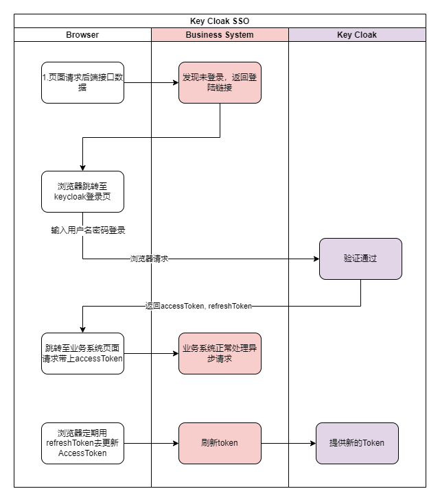
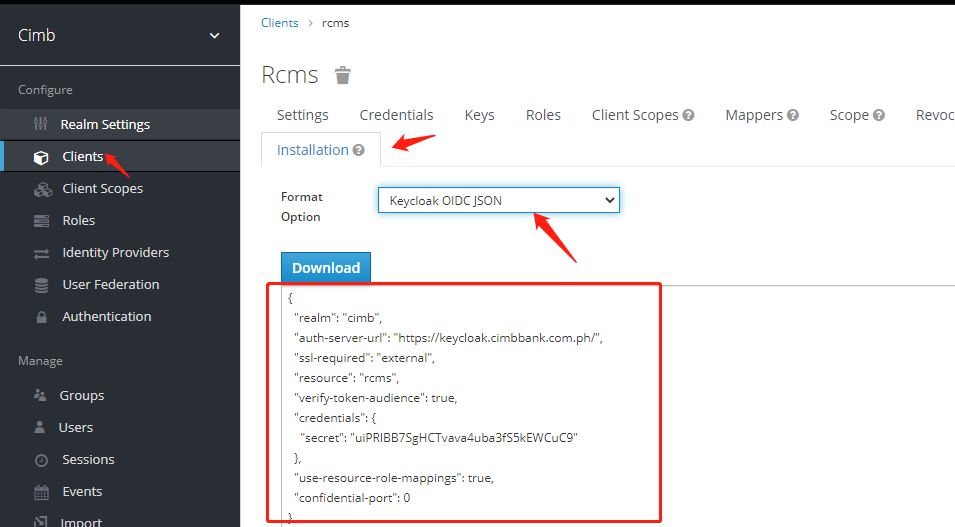

## Keycloak SDK

### Overview

keycloak提供了IAM的能力，自带的接入方式种类非常多，但是相对比较局限，对于微服务来说并不是很友好，本SDK提供了集成keycloak的核心能力，让应用快速对接keycloak.

**对接流程**

keycloak在登录成功后，会返回两个token

- accessToken : 记录用户的个人信息和角色信息，默认有效期5分钟。
- refreshToken : 用于获取新的accessToken和refreshToken，默认有效期30分钟。



从keycloak设计上来看，应用5分钟内可以基于accessToken做权限校验，此期间不需要跟keycloak服务器交互，避免给keycloak服务器带来太大压力。浏览器定时刷新accessToken的频率建议设置成1-2分钟。

### Quick Start

#### 添加依赖

在maven的pom.xml文件中，添加对keycloak-sdk的依赖。

```xml
<dependency>
    <groupId>io.github.zakiis</groupId>
    <artifactId>keycloak-sdk</artifactId>
    <version>0.0.5</version>
</dependency>
```

#### 创建context

使用keycloak之前，需要先创建KeyCloakContext对象，后续所有功能都由该context提供。每个客户端只需创建一个KeyCloakContext实例

```java
KeycloakContext context = new KeycloakContext("https://keycloak.cimbbank.com.ph", "cimb", "rcms", false, "uiPRlBB7SgHCTvava4uba3fS5kEWCuC9");
```

构造器需要的参数分别为：

- authURL : keycloak服务器地址
- realm : keycloak后管页面创建的项目名
- clientId : keycloak后管页面给当前客户端创建的id
- publicClient : 客户端是否不需要密码，生产环境应当设置成false
- clientSecret : 非public客户端，keycloak会给该客户端生成一份密钥

创建KeycloakContext对象需要的参数，可以从keycloak后管页面获取：



#### 生成登录URL

如果希望使用keycloak自带的登录页面，可以调用该方法生成keycloak的登录链接，前端跳转至该链接让用户进入登录流程。

```java
String url = context.genLoginURL("http://rcms.cimbbank.com.ph/");
```

该方法需要传用户在keycloak登录成功后，浏览器跳转到业务系统的地址。

#### 用户名密码登录

如果业务系统使用自己的登录页面，后端拿到用户的凭证后，可以调用该方法完成登录。

```java
Token token = context.login("jack", "123456");
```

#### 校验accessToken

登录完成后，前端访问后端需要做权限校验的接口时，都应传递accessToken参数，后端接口在处理业务之前，需要校验accessToken的合法性。校验成功后返回的IDToken对象包含用户的个人信息和权限信息，应用可根据该信息决定是否对当前访问的接口放行。

```java
IDToken idToken = context.verify(token.getAccessToken());
```

#### 刷新accessToken

由于accessToken默认只有5分钟的有效期，前端应当启动一个定时任务，建议1-2分钟执行一次，定期刷新accessToken

```shell
context.refreshToken(token.getRefreshToken());
```

#### 注销登录

如果用户需要退出登录，需要调用该接口完成全局退出。由于accessToken有5分钟的有效期，其它模块并不会实时调用keycloak的刷新accessToken接口，因此其它模块会等待下次刷新accessToken的时候才能完成退出。

```java
context.logout(refreshToken);
```

