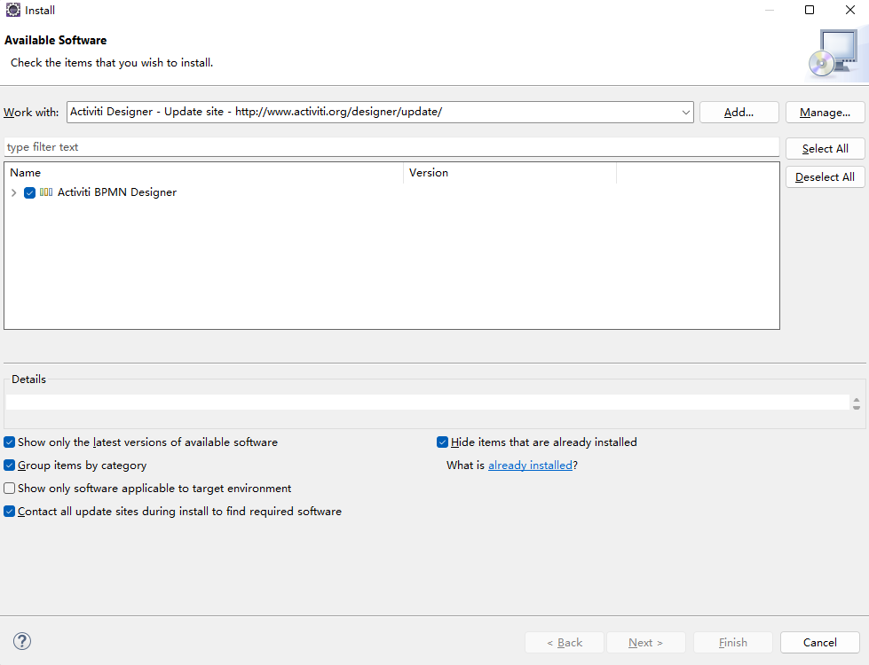
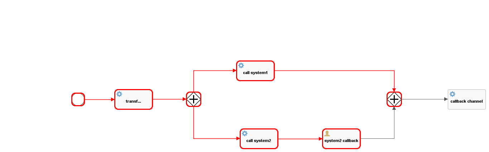
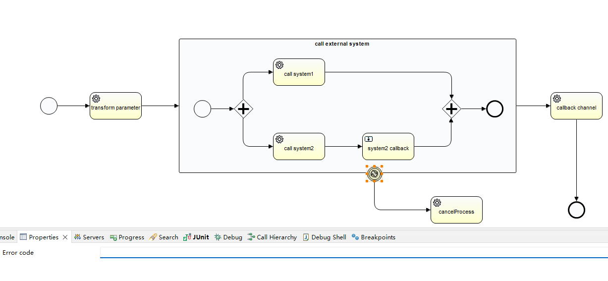

## workflow
### Introduction
This project is designed for demonstrate the way of integration with [Activiti6](https://www.activiti.org/), Which is the well-known framework of BPMN2.0 implementation by java language.

more details could find  on [activiti official document](https://www.activiti.org/userguide/#_introduction)

### Prepare Environment

BPMN (Business Process Modeling Notation) will provide businesses with the capability of understanding their internal business procedures in a graphical notation and will give organizations the ability to communicate these procedures in a standard manner. 

You could create and edit BPMN 2.0 diagrams in your browser on [BPMN.io](https://demo.bpmn.io/) web site.  Install a plugin on your IDE will help your draw flow efficently. On Eclipse： help -> Install New Software -> http://www.activiti.org/designer/update/



### Quick start

This project is designed for using as base project for those who are not familiarity with activiti framework but need using it in business service quickly.  It's integrated with activiti 6 on springboot platform cause from acitiviti 7 jdk11+ is required. There are three service you will find: 

#### WorkflowRepositoryService

works for deployment BPMN file which called `ProcessDefinition` in activiti world.  Deployment id is a non-meaning value, we often use process definition key  to retrieve a deployed process definition, which is the id attribute of process node in BPMN XML file .

```java
/**
 * deploy BPMN File to Activiti
 * @param processDefinitionXML BPMN file content
 * @return deployment id
 */
public String deployment(String processDefinitionXML);

/**
 * Retrieve process definition by key 
 * @param processDefinitionKey id attribute of process node in BPMN XML file 
 * @return Process definition
 */
public ProcessDefinitionDTO getProcessDefinitionByKey(String processDefinitionKey);
```

It also provides some enhanced method in case of you need the ability of edit flow diagram and update it on web.

```java
/**
 * Get BPMN XML content, It's useful if you have an web edit page for workflow editing.
 * @param processDefinitionKey
 * @return
 */
public String getProcessDefinitionXML(String processDefinitionKey);

/**
 * generate the diagram of this flow
 * @param processDefinitionKey id attribute of process node in BPMN XML file 
 * @param os output stream
 */
public void getProcessDefinitionDiagram(String processDefinitionKey, OutputStream os);
```

#### WorkflowRuntimeService

After deployed process definition, you can start a process instance through work flow runtime service.

```java
/**
 * start a new process instance
 * @param processDefinitionKey id attribute of process node in BPMN XML file 
 * @param businessKey business key
 * @param initiator who should be assigned to this process instance, null if no one.
 * @param params parameters that start a new process instance need.
 * @return process instance id
 */
public String startProcess(String processDefinitionKey, String businessKey, String initiator, Map<String, Object> params);

/**
 * generate the diagram of current process instance
 * @param businessKey
 * @param output
 */
public void getProcessInstanceDiagram(String businessKey, OutputStream output);
```

get process instance diagram API will highlight the flow that is executed, It may help you  analysis the process instance problems.



#### WorkflowTaskService

User task node can't executed automatically, activiti provides many functions to deal with user task, some of the operations are not required when you deal with user task.

```java
/**
 * complete task
 * @param taskid current task id
 * @param params parameters that task need
 */
public void completeTask(String taskid, Map<String, Object> params)
```

Further using about work flow API could find on test class:

- WorkflowRepositoryServiceTest
- WorkflowRuntimeServiceTest
- WorkflowTaskServiceTest
- ApiAdaptorWorkflowTest

### Core Tables

- ACT_RE_DEPLOYMENT process definition deployment
- ACT_RE_PROCDEF process definition
- ACT_GE_BYTEARRAY byte stream, for example  process deifnition xml, diagram
- ACT_RU_EXECUTION - process instance run process.
- ACT_RU_TASK - task need process
- ACT_HI_PROCINST - history of process instance
- ACT_HI_ACTINST - history of process instance flow node

## Concept

### Thread model

Task defaults using current thread(Activiti main thread),  this may cause other process instance create or other tasks run if the task needs much time to process , besides, if you are deleting current process instance on a service task, the process instance transaction is not committed so you can't delete it. To avoid these problems, you can check the property `Asynchronous` so that it and after  will run in another thread.


### User Task

User task is a type of task that need user to process, you should call complete task method to make the flow to next node.

```java
TaskDTO task = workflowTaskService.getTask(businessKey);
workflowTaskService.completeTask(task.getId(), params);
```

### Service Task

The service task provides the ability to run java codes to implements your business. That class must implements the interface `JavaDelegate`

```java
public class MyTask implements JavaDelegate {
	
	@Override
	public void execute(DelegateExecution execution) {
		String businessKey = execution.getProcessInstanceBusinessKey();
        //do something
    }
}
```

### Error Boundary Event

You may got some error on a task or a sub process and need do something, error boundary event can catch the specified error so you can deal with it.



boundary event will catch all the error event if you don't specify the error code. In service task, you can throw a BpmnError to trigger it.

```
public class MyTask implements JavaDelegate {
	
	@Override
	public void execute(DelegateExecution execution) {
		throw new BpmnError("10001", "call system1 got xxx excpetion");
    }
}
```

